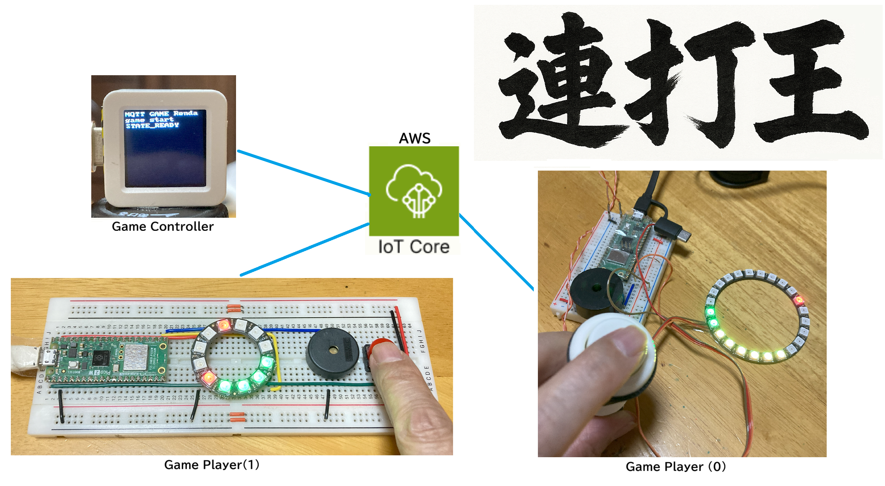
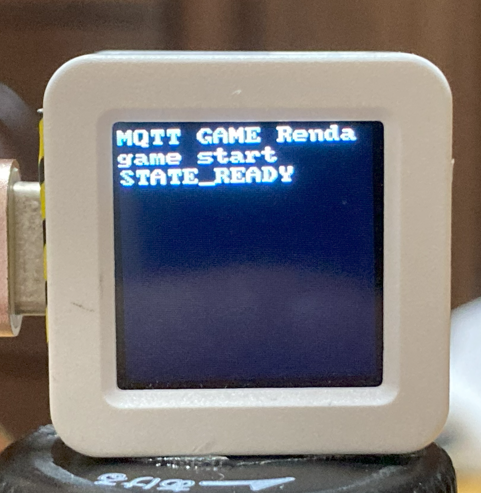
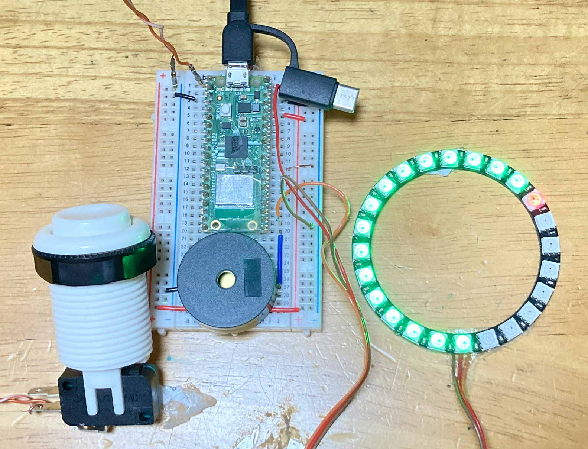
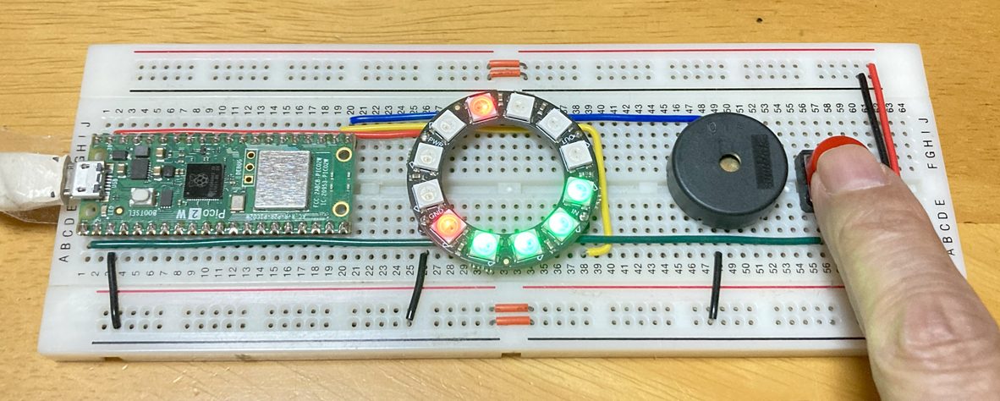
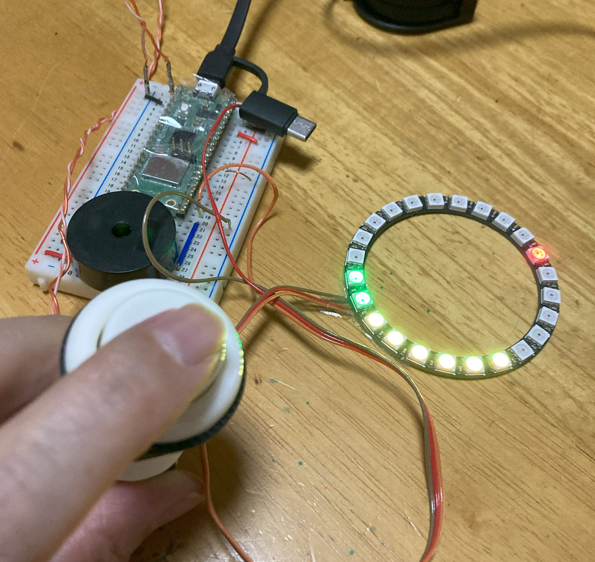

# 🕹️ MQTT Renda-Oh 2025: The Real-Time Button-Mash King Game

DEMO Movie：
https://drive.google.com/file/d/1WOuCrZswMCj2DSqqVXYJRTR5dIPYZR1s/view?usp=drive_link

MQTT Renda-Oh 2025 is a competitive button-mash game designed to leverage the MQTT protocol for real-time, distributed play. This project serves as an advanced educational showcase of IoT and embedded systems, created for the GitHub "For the Love of Code" hackathon (July 16 – September 22, 2025) [1].
## 🌟 Project Overview: The Joy of Extreme Real-Time Messaging
The primary concept of Renda-Oh (King of Mashing) is to have players compete by pressing physical buttons as many times as possible within a set period.
The Hackathon Hook: Absurd Real-Time Tactility (Joyfulness & Ingenuity)
The original prototype prioritized implementation simplicity by reporting scores in periodic batches. This enhanced version flips that design:
-  1 Click = 1 MQTT Message: Every single button press immediately triggers an MQTT report message publication. This maximizes the feeling of tactility and the "absurdity" of flooding the network with rapid, real-time updates for maximum vibe.
-  The Race for Speed: The winner is the player who achieves the highest click count when the competition ends.

Game Cntroller 
 

Game Player(0) 
 

Game Player(1) 
 

Click battle 
 

## 🏆 Hackathon Category
This project is submitted under:
Category 1: Buttons, Beeps, and Blinkenlights.
-  Fit: This category seeks hardware hacks that blink, beep, buzz, or surprise. Renda-Oh is fundamentally an interactive, physical, and tactile system utilizing buttons, Piezo speakers, and color LEDs to manage the competitive experience.

## ⚙️ Key Technical Enhancements (Execution & Difficulty)
The high-frequency messaging goal required solving critical constraints found in the original prototype:
- PIO for Optimized Input (Technical Difficulty): To ensure accurate counting and prevent CPU core resource consumption due to software debouncing, the PIO (Programmable Input/Output) feature of the Raspberry Pi Pico 2 W is utilized to count button presses independently of the main microcontroller process.
- High-Performance MQTT Broker Requirement (Execution): The high volume of "1 click = 1 message" reports necessitates a robust broker. The original public broker failed due to quota limitations (0x97: Quota Exceeded). Therefore, this version requires a high-performance broker like AWS IoT Core to handle the high message rate and maintain low latency.
- Robust State Synchronization: Critical game state transition messages (change-state) use MQTT QoS: 1 to guarantee delivery. The system implements a retransmission mechanism specifically to handle 0x97: Quota Exceeded responses from the broker, ensuring crucial messages are not lost and the game proceeds synchronously.

## 🖼️ Project Visuals (Appearance and Gameplay)
The system consists of the GameController and multiple GamePlayers.
- GamePlayer Setup: GamePlayers are built using MicroPython-enabled boards (e.g., Raspberry Pi Pico 2 W/Pico W) connected to a physical switch, a Color LED (NeoPixel), and a Piezo Speaker.
- Game Flow Feedback:
    - Countdown: Game start and stop are signaled by synchronized flashing LED patterns and Piezo speaker melodies.
    - Live Score Indicator: During the match, the Color LED functions as an indicator, visualizing the click count of the player and the opponent. The length of the indicator represents the lead, showing which player is currently ahead.
    - Victory: After aggregation, synchronized sound and victory displays indicate the winner.
- Distributed Play: Though the demo units may be adjacent, all score updates and state changes are routed via the MQTT broker, enabling competition between players in remote locations.

## 🧩 Software Architecture
The software structure centralizes complex networking and state logic into a common class.
1. Core Modules
The software is structured around three key classes:
- Controller Class: Handles game progression instructions, score aggregation, and victory determination.
- Player Class: Manages user output via the Color LED and Piezo speaker, and displays the opponent's score periodically.
- GameAgent Class: The core management layer, consolidating MQTT message sending/receiving and the game state machine logic.
2. Game State and Synchronization
- State Machine Implementation: The game flow is divided into 12 distinct states (e.g., countdowns, reporting, result display).
- Synchronous Transitions: All GamePlayers transition states simultaneously, triggered by synchronous instructions (change-state messages) issued by the GameController. This state transition logic is implemented declaratively using a common state transition table (dictionary format) within the shared GameAgent class.
3. Communication Protocol (MQTT Topics)

## 📚 Educational Highlights
This project provides practical, hands-on experience:
- Implementing robust communication and state synchronization using the MQTT protocol.
- Advanced embedded techniques like using PIO for reliable, low-latency input counting.
- Embedded development using MicroPython on modern microcontrollers.
- Integrating physical I/O: switches, SPI-connected LCDs, LEDs, and sound effects.

## 💻 Setup and Dependencies

Hardware Requirements:
- GamePlayer (MicroPython): Raspberry Pi Pico 2 W (RP2350) or Pico W (RP2040).
- GameController (MicroPython): M5STACK AtomS3 (ESP32-S3) .
- I/O Components: Pushbutton switch, Color LED (NeoPixel Ring), Piezo Speaker.

Software & Service Requirements:
- Embedded OS: MicroPython(for gameController , gamePlayer).
- MQTT Client: umqtt.simple (MQTT V3) for GamePlayer and GameController.
- MQTT Broker: AWS IoT Core or equivalent high-performance, low-latency broker with permissive quota policies is required for the "1 click = 1 message" mode.
- Color Display Driver (for M5STACK AtomS3)
  - Please retrieve the modules st7789py.py, vga1_8x8.py and tft_config.py from repository https://github.com/russhughes/st7789py_mpy/tree/master 

## ⚠️ Paid service in use

Free public MQTT brokers cannot reliably support the high-frequency message delivery required for this project. An MQTT broker without quota restrictions and with low latency is necessary. For this demonstration, AWS IoT Core has been adopted.

--------------------------------------------------------------------------------
We encourage feedback, Questions and suggestions are welcome via Issues or Pull Requests!

The hackathon’s MQTT Battle Game is built on the version I originally developed for Interface magazine. 
https://github.com/foobarbazfred/mqtt-based-game
Although using existing code from other sources would have been fine, I decided to recreate it specifically for this entry.

[1] https://github.blog/open-source/for-the-love-of-code-2025/
