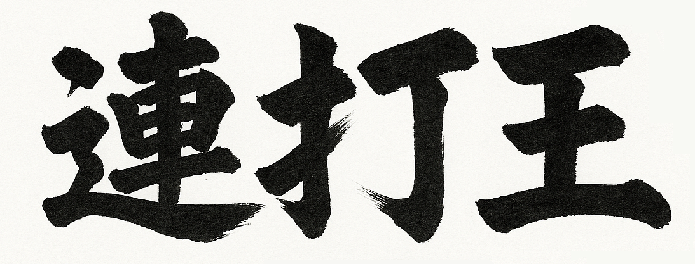

# MQTT Renda-Oh 2025: The Real-Time Button-Mash King Game

**MQTT Renda-Oh 2025** is a real-time button mash battle game designed to help you learn IoT and embedded systems in a fun and interactive way.  
This project was created for GitHub's "For the Love of Code 2025" hackathon and is an advanced, educational revamp of the original MQTT-based button-mash game.

## Project Overview

Players compete by pressing physical buttons connected to an AtomS3 (ESP32-S3) microcontroller running MicroPython.  
Each button press sends a score update via MQTT, and game state—including scores and victory effects—is displayed on a GC9107 LCD (SPI interface).  
The project is specifically designed to teach beginners about **hardware/software integration, SPI communication, and MQTT messaging** through hands-on gameplay.

## Technical Architecture

- **AtomS3 (ESP32-S3):**  for GameController  
  A high-performance microcontroller with Wi-Fi/Bluetooth, ideal for MicroPython scripting, GPIO handling
- **MicroPython:**  
  A lightweight Python implementation optimized for embedded devices, enabling easy scripting directly on microcontrollers.
- **GC9107 LCD (SPI):**  
  A color display connected via SPI bus, used to present scores, game progress, and victory animations.
- **MQTT (Pub/Sub Model):**  
  An efficient, lightweight messaging protocol for IoT. Each device publishes its score updates; the broker aggregates and distributes game state in real time.
- **PIO (Programmable IO):**  
  Used for optimizing SPI operations and boosting overall performance for unti chattering and click count.
- **MQTT Broker:**  
  For optimal performance, this system requires an MQTT broker with minimal latency and permissive quota policies.
  As a result, deploying an MQTT broker on the local network or using AWS IoT Core’s MQTT broker is required

## Game Flow

1. Players mash physical buttons connected to AtomS3.
2. Each press triggers MicroPython code to send an MQTT message with the current score.
3. The MQTT broker collects and distributes score updates from all devices.
4. The GC9107 LCD displays live scores and game status.
5. Victory triggers synchronized sound and LED effects using AtomS3's onboard features.

## Target Audience & Use Cases

- Beginners and intermediate learners in IoT or embedded systems
- Educators and workshop facilitators
- Hackathon participants and demo presenters
- Button-mash game enthusiasts and tech explorers

## Hackathon Category

- Category 1: Buttons, beeps, and blinkenlights

## Key Technical Enhancements

- **Interactive MQTT Messaging:**  
  Immediate MQTT message publication in response to button presses, ensuring seamless user-system feedback.
- **Enhanced Victory Effects:**  
  Synchronized sound and dynamic LED color effects celebrate wins, increasing immersion and excitement.
- **Full MicroPython Support:**  
  Refactored for complete MicroPython compatibility, removing dependency on standard Python 3 and expanding hardware flexibility.
- **LCD Display Integration:**  
  The built-in AtomS3 LCD now shows real-time game state and scores, improving player engagement and visibility.

## Educational Highlights

- Hands-on learning of MQTT-based device communication and synchronization
- Practical experience with SPI hardware control
- Embedded development using MicroPython
- Integration of physical input, visual output, and sound effects

---

For setup instructions, sample code, or circuit diagrams, please refer to the `src` directory or project Wiki.  
This project is ideal for education, workshops, IoT demos, or as a technical showcase at events.  
Questions and suggestions are welcome via Issues or Pull Requests!
